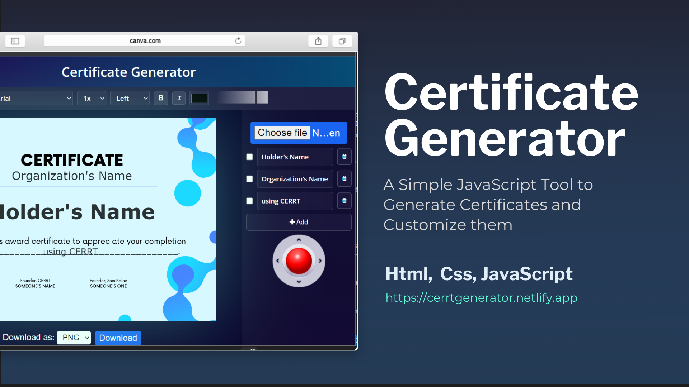

<div align="center">


[](https://github.com/semikolan-co/certificate-generator/issues)
[](https://github.com/semikolan-co/certificate-generator/network)
[](https://github.com/semikolan-co/certificate-generator/stargazers)
  
</div>

<!-- 
# SemiKolan

Semikolan is a Platform for like minded Learners, Developers and Enthusiasts to Learn, Connect, create great connections and work on various Open-Source projects. SemiKolan is a Community `For the Developers, By the Developers, To the Developers`.


### Table of Contents
- [SemiKolan](#semikolan)
    - [Table of Contents](#table-of-contents)
  - [Installation Guide](#installation-guide)
  - [File Structure](#file-structure)
  - [Join Us](#join-us)
  - [Color Reference](#color-reference)
  - [Code Contributers](#code-contributers)


## Installation Guide

Before Any of the following steps, make sure you have installed the Nodejs and Git in your system. You can simply install Nodejs from [here](https://nodejs.org/en/) and Git from [here](https://git-scm.com/downloads)
Now you can follow the steps below to install Instalyzer.
Fork the [Github Repository](https://github.com/semikolan-co/certificate-generator) and clone it to your local machine. You can clone using a simple command like this:
```sh
git clone https://github.com/<your_username>/semikolan-react.git 
``` 

Then move to the root directory of the cloned repository. You can do this by typing the following command:
```sh
cd semikolan-react
```

Now run the following command to install the dependencies:
```sh
npm install
```
Now you can run the following command to start the server:
```sh
npm start
```
Congratulations! You have successfully installed SemiKolan Website. Your server is running on localhost:3000

## File Structure
Within the download you'll find the following directories and files:

```
semikolan-react
├── README.md
├── CONTRIBUTING.md
├── package.json
├── package-lock.json
├── staticwebapp.config.json
├── .gitignore
├── public
│   ├── favicon.ico
│   ├── favicon.png
│   ├── index.html
│   └── manifest.json
└── src
    ├── index.js
    ├── App.js
    ├── projects.json
    ├── links.json
    ├── semikolan.json
    ├── images
    │   └── .....Contains Images 
    ├── lottie
    │   └── .....Contains Lottie 
    └── components
        ├── userprofile
        │   ├── harsh.json
        │   └── Profile.js
        ├── About.js
        ├── Achievements.js
        ├── API.js
        ├── BongoCat.js
        ├── Captcha.js
        ├── Community.js
        ├── Contact.js
        ├── ContactForm.js
        ├── Error404.js
        ├── Footer.js
        ├── Header.js
        ├── Introduce.js
        ├── Join.js
        ├── Landing.js
        ├── Links.js
        ├── Loader.js
        ├── Map.js
        ├── Quiz.js
        ├── Skills.js
        ├── Technologies.js
        ├── Whatwedo.js
        └── Work .js
```

## Join Us

Be a part of the SemiKolan Developer's Community by joining our [Discord Server](https://discord.semikolan.co). Here you can discuss about the project or ask any other queries and there will be a lot of folks to help

[](https://discord.semikolan.co)


## 🎨 Color Reference

| Color          | Hex                                                                |
| -------------- | ------------------------------------------------------------------ |
| Navy           |  `#0a192f` |
| Light Navy     |  `#112240` |
| Lightest Navy  |  `#233554` |
| Slate          |  `#8892b0` |
| Light Slate    |  `#a8b2d1` |
| Lightest Slate |  `#ccd6f6` |
| White          |  `#e6f1ff` |
| Green          |  `#64ffda` |


## Code Contributers

This project exists thanks to all the people who contribute. [[Contribute](CONTRIBUTING.md)].

<a href="https://github.com/semikolan-co/certificate-generator/graphs/contributors">
  
</a> -->
